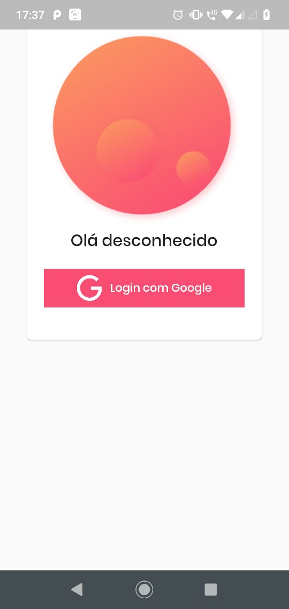
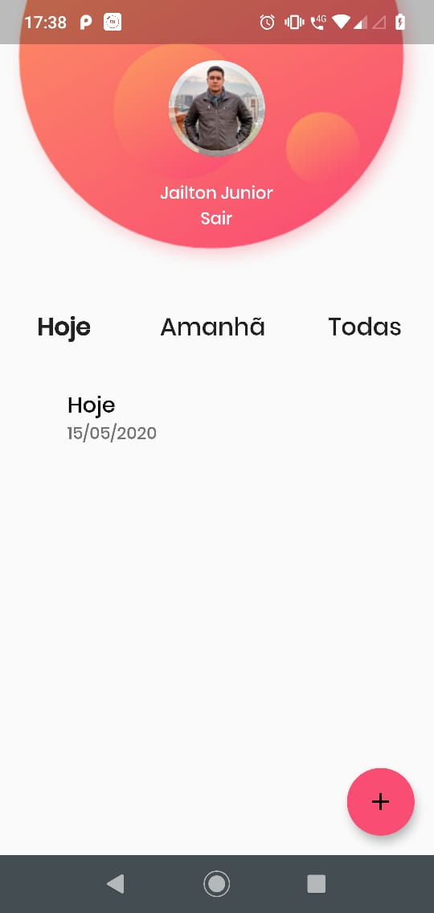
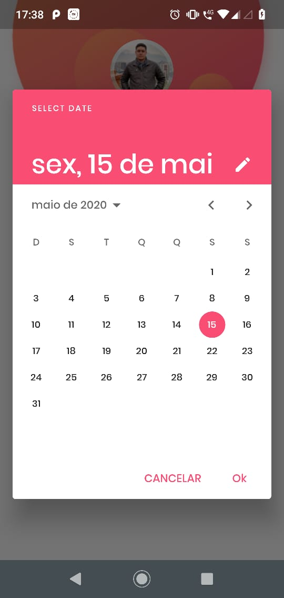
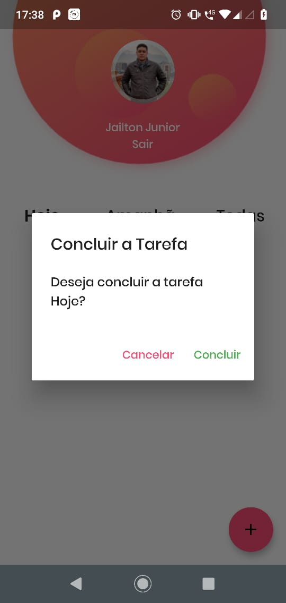

## O que é?
Curso de criação de um App Mobile do Todo App utilizando Flutter, MobX e Firebase

## Tecnologias
- Flutter
- Dart
- Firebase
- MobX


## Balta.io Develop your career
[Curso - Todo App: Mobile com Flutter, MobX e Firebase](https://app.balta.io/courses/7198)

## Certificado


## App - Images
<p align="center">
  
  
  
  
</p>

## MobX
- Para gerar o código do MobX na pasta raiz do projeto executar:
- Comando para limpar código gerado pelo MobX caso exista.
```
flutter packages pub run build_runner clean
```
- Comando para gerar código do MobX:
```
flutter packages pub run build_runner build
``` 

## IDE utilizada
[Visual Studio Code](https://code.visualstudio.com/)

## Extensões Visual Studio Code 
[Flutter](https://marketplace.visualstudio.com/items?itemName=Dart-Code.flutter)<br/>
[Dart](https://marketplace.visualstudio.com/items?itemName=Dart-Code.dart-code)<br/>

## Requisitos
[Flutter get started](https://flutter.dev/docs/get-started/install)